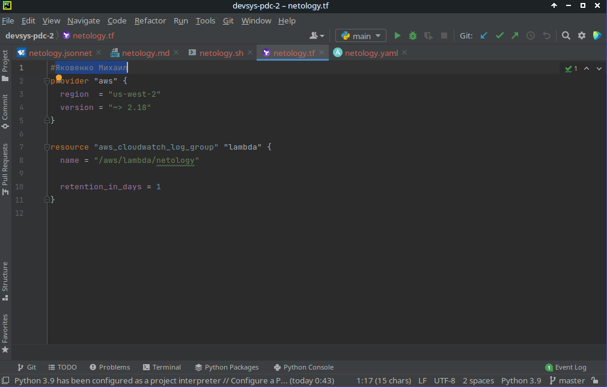
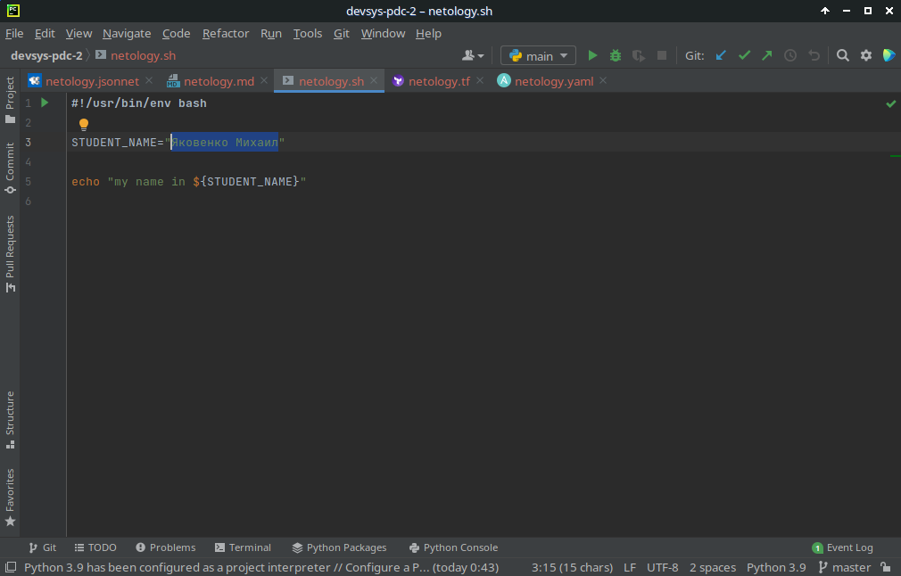
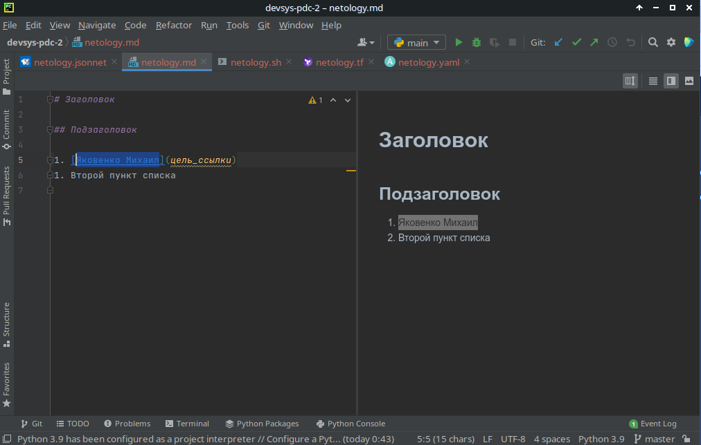
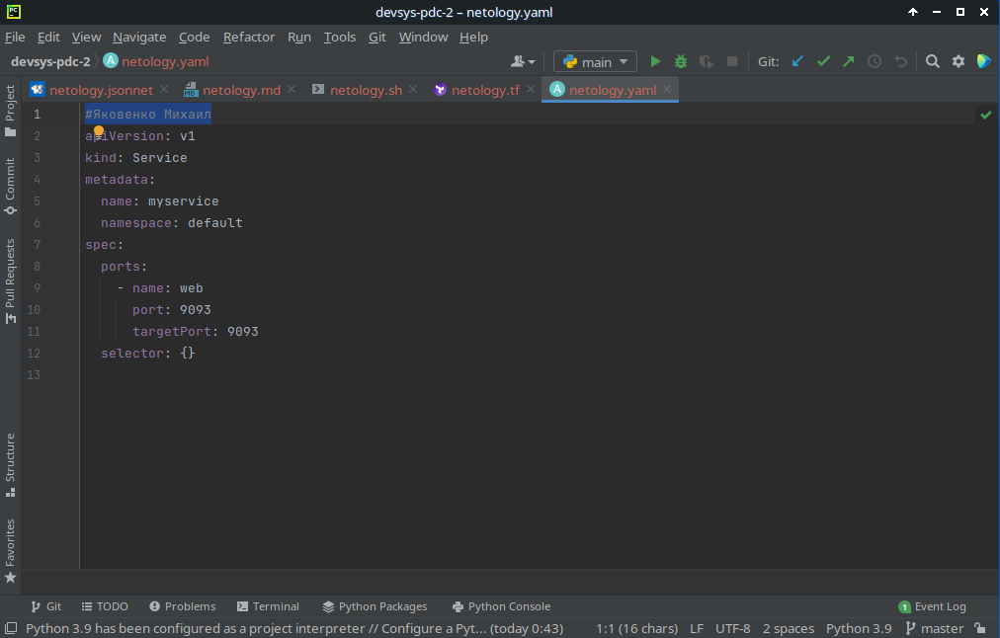
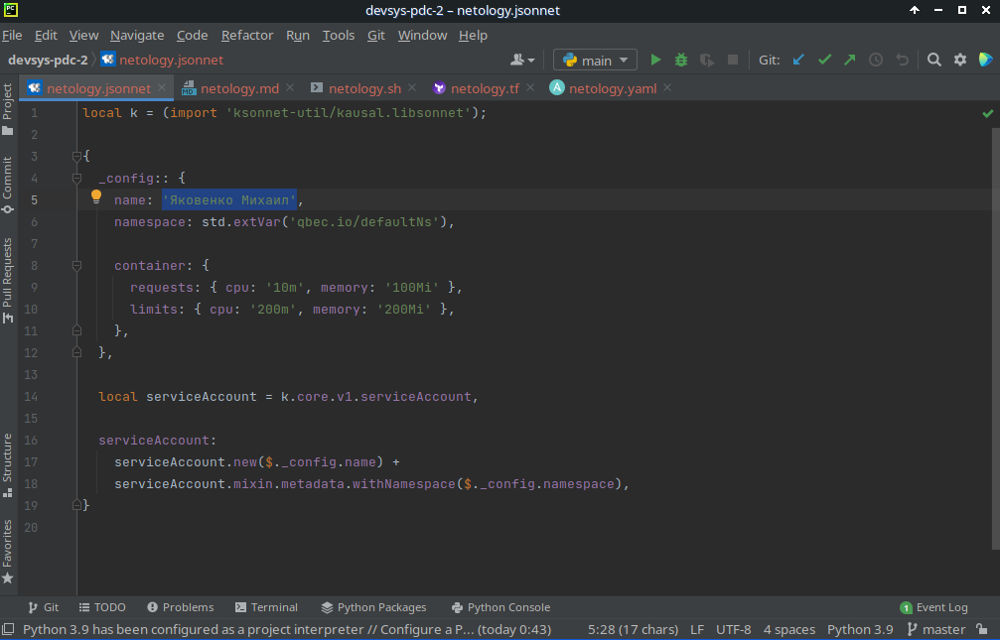

# 1.1. Введение в DevOps — Яковенко Михаил
Домашнее задание к занятию «1.1. Введение в DevOps»

---
## Задание №1 - Подготовка рабочей среды

Вы пришли на новое место работы или приобрели новый компьютер.
Первым делом надо настроить окружение для дальнейшей работы. 

1. Установлена среда PyCharm Community Edition.  
1. Установлены плагины:
    - Terraform and HCL,
    - Markdown,
    - Yaml/Ansible Support,
    - Jsonnet.
1. Скопированы файлы для проверки подсветки синтаксиса, в них внесены изменения с моим именем
    - [netology.tf](netology.tf),
    - [netology.sh](netology.sh),
    - [netology.md](netology.md), 
    - [netology.yaml](netology.yaml),
    - [netology.jsonnet](netology.jsonnet).
1. Созданы скриншоты с проверкой синтаксиса:
    - Terraform: [netology_tf.png](img/netology_tf.png)
       
    - Bash: [netology_sh.png](img/netology_sh.png) 
      
    - Markdown: [netology_md.png](img/netology_md.png) 
      
    - Yaml: [netology_yaml.png](img/netology_yaml.png)
      
    - Jsonnet: [netology_jsonnet.png](img/netology_jsonnet.png) 
      
1. Добавьте свое имя в каждый файл, сделайте снимок экрана и загрузите его на любой сервис обмена картинками.
1. Ссылки на картинки указал в личном кабинете как решение домашнего задания. 

##Задание №2 - Описание жизненного цикла задачи (разработки нового функционала)

Этапы разработки нового функционала в рамках действующего интернет-магазина вижу так:
1. Запрос от клиента на новую задачу
2. Интервьюирование клиента менеджером 
3. Совещание между менеджером, разработчиками и DevOps о выборе подходящих инструментов и инфраструктуры
4. Формирование ТЗ
5. Согласование ТЗ с клиентом
6. Разворачивание DevOps dev среды
7. Разработка ПО
8. Разворачивание DevOps тестовых сред
9. Тестирование разработанного ПО
10. Сдача ПО клиенту
11. Выпуск DevOps разработанного ПО на PROD
